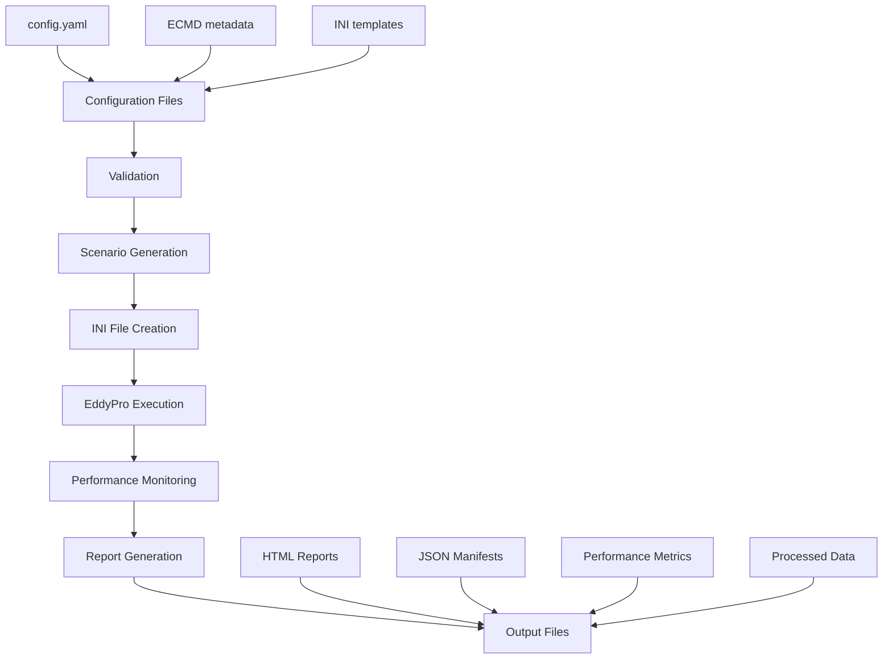

# EddyPro Batch Processor - Architecture Documentation

**Project:** EddyPro Batch Processor
**Version:** 0.2.0
**Date:** October 2, 2025

---

## Table of Contents

- [Overview](#overview)
- [Package Structure](#package-structure)
- [Data Flow](#data-flow)
- [Module Responsibilities](#module-responsibilities)
- [Key Design Decisions](#key-design-decisions)
- [Extension Points](#extension-points)
- [Dependencies](#dependencies)
- [Configuration System](#configuration-system)
- [Error Handling Strategy](#error-handling-strategy)
- [Testing Architecture](#testing-architecture)

---

## Overview

The EddyPro Batch Processor is a Python application designed to automate the processing of eddy covariance data using LI-COR's EddyPro software. The architecture follows a modular design with clear separation of concerns, enabling batch processing, scenario testing, performance monitoring, and comprehensive reporting.

### Core Principles

1. **Modular Design**: Each module has a single responsibility
2. **Configuration-Driven**: All behavior controlled via YAML configuration
3. **CLI-First**: Command-line interface for all operations
4. **Offline Operation**: No network dependencies during processing
5. **Deterministic**: Reproducible results with proper logging and manifests
6. **Performance Aware**: Built-in monitoring and reporting

---

## Package Structure

```
src/eddypro_batch_processor/
├── __init__.py              # Package exports and version
├── cli.py                   # Command-line interface and entry points
├── core.py                  # Main business logic and orchestration
├── ini_tools.py             # EddyPro INI file manipulation
├── monitor.py               # Performance monitoring and metrics
├── report.py                # Report generation (HTML, JSON, manifest)
├── scenarios.py             # Scenario generation and Cartesian products
└── validation.py            # Configuration and data validation
```

### File Responsibilities

| Module | Primary Responsibility | Key Classes/Functions |
|--------|----------------------|----------------------|
| `cli.py` | Command-line interface | `main()`, `cmd_run()`, `cmd_scenarios()`, `cmd_validate()`, `cmd_status()` |
| `core.py` | Business logic orchestration | `EddyProBatchProcessor`, `load_config()`, `validate_config()` |
| `ini_tools.py` | EddyPro configuration management | `create_patched_ini()`, `validate_parameter()` |
| `monitor.py` | Performance monitoring | `PerformanceMonitor`, `MonitoredOperation` |
| `report.py` | Output generation | `generate_html_report()`, `generate_run_manifest()` |
| `scenarios.py` | Scenario management | `generate_scenarios()`, `Scenario` dataclass |
| `validation.py` | Input validation | `validate_all()`, `validate_config_structure()` |

---

## Data Flow

The application follows a clear data flow from configuration through processing to reporting:



### Detailed Flow

1. **Configuration Loading** (`core.py`)
   - Load `config.yaml` with user settings
   - Merge with CLI overrides
   - Validate structure and types

2. **Input Validation** (`validation.py`)
   - Check file paths and executables
   - Validate ECMD metadata format
   - Verify parameter constraints

3. **Scenario Generation** (`scenarios.py`)
   - Generate Cartesian product of parameters
   - Apply scenario caps and validation
   - Create deterministic naming

4. **INI File Preparation** (`ini_tools.py`)
   - Load template INI files
   - Apply parameter patches
   - Write scenario-specific configurations

5. **Processing Execution** (`core.py`)
   - Launch EddyPro with monitoring
   - Capture performance metrics
   - Handle errors and timeouts

6. **Report Generation** (`report.py`)
   - Generate HTML reports with charts
   - Create JSON manifests
   - Package performance data

---

## Module Responsibilities

### CLI Module (`cli.py`)

**Purpose**: Command-line interface and user interaction

**Key Functions**:
- `main()`: Entry point and argument parsing
- `cmd_run()`: Single/multi-year processing pipeline
- `cmd_scenarios()`: Scenario matrix execution
- `cmd_validate()`: Configuration validation
- `cmd_status()`: Results summary

**Design Notes**:
- Uses `argparse` for robust CLI parsing
- Delegates business logic to other modules
- Handles user-facing error messages
- Supports dry-run mode for testing

### Core Module (`core.py`)

**Purpose**: Main business logic and orchestration

**Key Classes**:
- `EddyProBatchProcessor`: Main processing class

**Key Functions**:
- `load_config()`: Configuration file handling
- `validate_config()`: Configuration validation
- `run_single_scenario()`: Individual scenario execution
- `run_scenario_batch()`: Batch scenario processing

**Design Notes**:
- Stateful processor class for configuration
- Supports both single runs and batch processing
- Integrates with monitoring and reporting
- Handles subprocess execution of EddyPro

### INI Tools Module (`ini_tools.py`)

**Purpose**: EddyPro configuration file management

**Key Functions**:
- `create_patched_ini()`: Generate scenario-specific INI files
- `validate_parameter()`: Parameter validation
- `generate_scenario_suffix()`: Deterministic naming

**Design Notes**:
- Uses `configparser` for INI manipulation
- Validates parameters against EddyPro constraints
- Generates deterministic suffixes for scenarios
- Supports template-based configuration

### Monitor Module (`monitor.py`)

**Purpose**: Performance monitoring and metrics collection

**Key Classes**:
- `PerformanceMonitor`: Metrics collection
- `MonitoredOperation`: Context manager for monitoring

**Design Notes**:
- Uses `psutil` for system metrics (optional)
- Thread-safe monitoring with configurable intervals
- Graceful degradation when `psutil` unavailable
- CSV and JSON output formats

### Report Module (`report.py`)

**Purpose**: Output generation and visualization

**Key Functions**:
- `generate_html_report()`: Interactive HTML reports
- `generate_run_manifest()`: JSON metadata
- `generate_plotly_charts()`: Performance visualizations

**Design Notes**:
- Uses `plotly` for interactive charts (optional)
- Template-based HTML generation
- Comprehensive manifest with provenance
- Fallback modes for missing dependencies

### Scenarios Module (`scenarios.py`)

**Purpose**: Scenario generation and management

**Key Classes**:
- `Scenario`: Immutable scenario representation

**Key Functions**:
- `generate_scenarios()`: Cartesian product generation
- `validate_scenario_parameters()`: Parameter validation

**Design Notes**:
- Frozen dataclasses for immutability
- Deterministic ordering for reproducibility
- Hard cap enforcement (32 scenarios)
- Comprehensive parameter validation

### Validation Module (`validation.py`)

**Purpose**: Input validation and error checking

**Key Functions**:
- `validate_all()`: Comprehensive validation
- `validate_config_structure()`: Configuration validation
- `validate_ecmd_schema()`: Metadata file validation

**Design Notes**:
- Early validation with actionable error messages
- Categorized validation results
- Optional validation components
- Defensive programming approach

---

## Key Design Decisions

### 1. Modular Architecture

**Decision**: Split monolithic script into focused modules

**Rationale**:
- Easier testing and maintenance
- Clear separation of concerns
- Better code reuse
- Simplified debugging

**Trade-offs**:
- More complex imports
- Potential circular dependencies (avoided through design)

### 2. Configuration-Driven Behavior

**Decision**: Single YAML configuration file controls all behavior

**Rationale**:
- Single source of truth
- Easy to version control
- CLI overrides for flexibility
- Clear documentation of options

**Implementation**: `config/config.yaml` with CLI parameter overrides

### 3. Immutable Scenarios

**Decision**: Use frozen dataclasses for scenario representation

**Rationale**:
- Prevents accidental mutations
- Clear contract for scenario data
- Easier debugging and testing
- Deterministic behavior

**Implementation**: `@dataclass(frozen=True)` for `Scenario` class

### 4. Optional Dependencies

**Decision**: Graceful degradation for optional packages

**Rationale**:
- Core functionality works without extras
- Enhanced features available when desired
- Easier deployment in constrained environments

**Implementation**: Try/except imports with fallback behavior

### 5. Process-Based Parallelism

**Decision**: Use subprocess for EddyPro execution, process-based for parallel years

**Rationale**:
- EddyPro is external executable
- Avoid Python GIL limitations
- Better resource isolation
- Configurable worker counts

### 6. Comprehensive Logging and Manifests

**Decision**: Log everything and generate detailed manifests

**Rationale**:
- Debugging and troubleshooting
- Reproducibility and provenance
- Performance analysis
- Audit trail

---

## Extension Points

The architecture provides several extension points for future enhancements:

### 1. New Commands

**Location**: `cli.py`
- Add new `cmd_*()` functions
- Register in argument parser
- Follow existing patterns

### 2. Additional Validators

**Location**: `validation.py`
- Implement new `validate_*()` functions
- Add to `validate_all()` aggregation
- Follow error reporting patterns

### 3. Custom Reports

**Location**: `report.py`
- Add new `generate_*_report()` functions
- Support additional output formats
- Integrate with existing templates

### 4. New Monitoring Metrics

**Location**: `monitor.py`
- Extend `PerformanceMonitor` class
- Add new metric collection methods
- Update output formats

### 5. Parameter Types

**Location**: `ini_tools.py`
- Add new parameter validation
- Extend `validate_parameter()` function
- Update parameter information

---

## Dependencies

### Core Dependencies

- **PyYAML**: Configuration file parsing
- **Python 3.8+**: Language runtime

### Optional Dependencies

- **psutil**: System monitoring (graceful fallback)
- **plotly**: Interactive charts (SVG fallback)
- **jinja2**: Advanced templating (future use)

### Development Dependencies

- **pytest**: Test framework
- **coverage**: Test coverage
- **ruff**: Linting
- **black**: Code formatting
- **mypy**: Type checking
- **pre-commit**: Git hooks

---

## Configuration System

### Configuration Hierarchy

1. **Default values** (hardcoded in modules)
2. **config.yaml** (user configuration)
3. **CLI arguments** (runtime overrides)

### Configuration Structure

```yaml
# Core settings
eddypro_executable: "/path/to/eddypro"
site_id: "GL-ZaF"
years_to_process: [2021, 2022]

# Path patterns
input_dir_pattern: "/data/raw/{site_id}/{year}"
output_dir_pattern: "/data/processed/{site_id}/{year}"
ecmd_file: "/data/{site_id}_ecmd.csv"

# Processing options
multiprocessing: true
max_processes: 4
stream_output: true

# Monitoring
metrics_interval_seconds: 0.5

# Reporting
reports_dir: null  # Auto-generate
report_charts: "plotly"  # plotly, svg, none
```

### Template System

**INI Templates**: Located in `config/` directory
- `EddyProProject_template.ini`: Main project template
- `*_metadata_template.ini`: Site-specific metadata

**Placeholder Substitution**: Uses `{parameter}` syntax for dynamic values

---

## Error Handling Strategy

### Validation Errors

**Philosophy**: Fail fast with actionable messages

**Implementation**:
- Early validation before processing
- Categorized error types
- Specific guidance for fixes
- Exit codes for automation

### Runtime Errors

**Philosophy**: Graceful degradation where possible

**Strategies**:
- Optional dependency fallbacks
- Retry mechanisms for I/O
- Quarantine bad records (don't drop silently)
- Comprehensive logging

### EddyPro Execution Errors

**Philosophy**: Capture and report all subprocess errors

**Implementation**:
- Capture stdout/stderr
- Parse error codes
- Include in manifests
- Continue processing other scenarios when possible

---

## Testing Architecture

### Test Structure

```
tests/
├── test_cli.py                 # CLI interface tests
├── test_cli_functions.py       # CLI function unit tests
├── test_core.py                # Core business logic tests
├── test_e2e_integration.py     # End-to-end integration tests
├── test_ini_tools.py           # INI manipulation tests
├── test_monitor.py             # Performance monitoring tests
├── test_report.py              # Report generation tests
├── test_scenarios.py           # Scenario generation tests
└── test_validation.py          # Validation function tests
```

### Testing Principles

1. **Deterministic**: No random data, fixed seeds
2. **Isolated**: Temp directories, mocked externals
3. **Fast**: Unit tests complete quickly
4. **Comprehensive**: High coverage on core logic
5. **Integration**: E2E tests for user workflows

### Coverage Targets

- **Overall**: ≥70% (current: 71.79%)
- **Core modules**: ≥90% target
- **CLI**: Focus on business logic paths
- **Edge cases**: Error conditions and fallbacks

---

## Performance Considerations

### Memory Management

- **Chunked I/O**: Process large files in chunks
- **Generator patterns**: Avoid loading entire datasets
- **Resource cleanup**: Proper context managers

### CPU Utilization

- **Process parallelism**: Avoid GIL limitations
- **Configurable workers**: Don't over-subscribe
- **Monitoring overhead**: Minimal impact on main processing

### I/O Optimization

- **Atomic writes**: Temp file + move pattern
- **Batch operations**: Minimize file system calls
- **Idempotent operations**: Support retries and resumption

---

## Future Architecture Considerations

### Scalability

- **Distributed processing**: Multi-machine scenarios
- **Cloud deployment**: Container-friendly design
- **Database backend**: Replace file-based manifests

### Extensibility

- **Plugin system**: External parameter validators
- **Custom processors**: Non-EddyPro backends
- **API interface**: REST API for programmatic access

### Monitoring

- **Metrics export**: Prometheus/InfluxDB integration
- **Real-time dashboards**: Web-based monitoring
- **Alerting**: Email/Slack notifications

---

**Document Version**: 1.0
**Last Updated**: October 2, 2025
**Next Review**: December 2025
